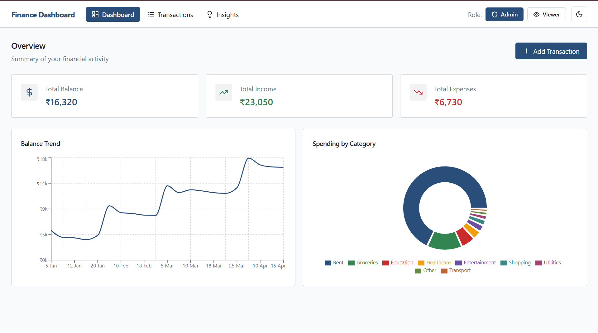
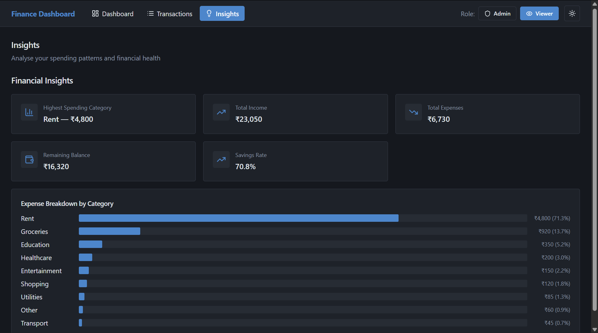
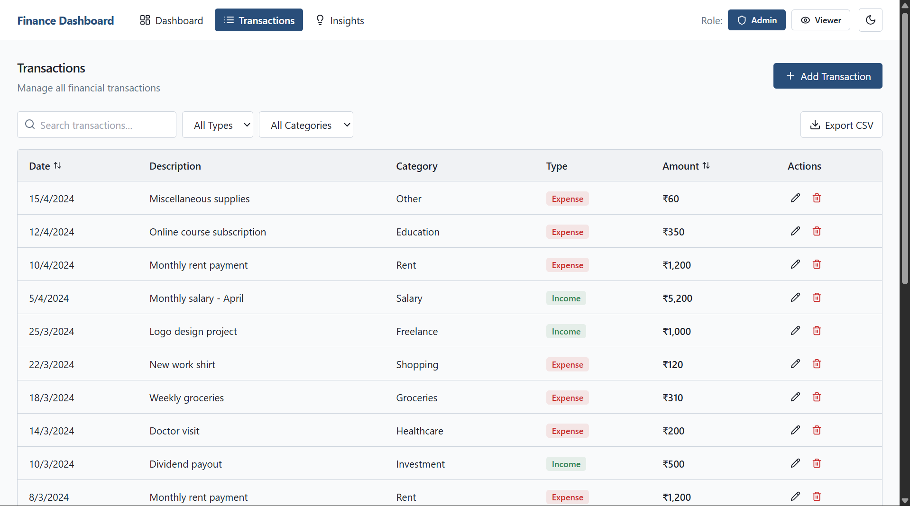

# Smart Finance Dashboard

A clean, minimal, and professional finance dashboard designed to present financial data in a structured and user-friendly way.

The UI follows a government-style design approach, focusing on clarity, usability, and simplicity rather than flashy visuals.

---

## 🌐 Live Demo

https://smart-finance-dashboard-two.vercel.app/

---

## 🛠️ Tech Stack


---

## ✨ Features

- Dashboard overview with financial summary cards  
- Balance trend visualization (time-based analytics)  
- Spending breakdown by category  
- Transaction management system  
- Search, filter, and sort transactions  
- Role-based UI (Admin / Viewer toggle)  
- CSV export functionality  
- Insights section for quick analysis  
- Responsive design for multiple screen sizes  

---

## 📸 Screenshots

### Dashboard Overview


### Analytics & Charts


### Transactions Management


---

## 📁 Project Structure


Smart-Finance-Dashboard/
│── public/
│── src/
│ ├── components/
│ ├── pages/
│ ├── assets/
│ ├── App.tsx
│ └── main.tsx
│── package.json
│── vite.config.ts
│── tailwind.config.js


---

## 🚀 Getting Started

### Clone the repository

```bash
git clone https://github.com/aashiyadav30/Smart-Finance-Dashboard.git
cd Smart-Finance-Dashboard
Install dependencies
npm install
Run development server
npm run dev
Build for production
npm run build

🌍 Deployment

This project is deployed on Vercel.

To deploy your own version:

Push your code to GitHub
Import the repository into Vercel
Deploy with one click
🎯 Design Philosophy
Minimal and clean interface
Structured layout inspired by government and banking platforms
Focus on readability and usability
Avoid unnecessary animations and clutter

👩‍💻 Author

Aashi Yadav

📄 License

This project is licensed under the MIT License.
